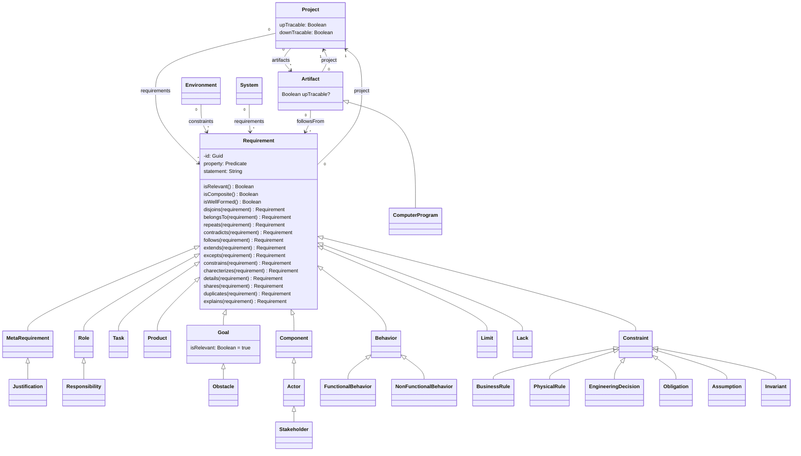

# Architecture

```mermaid
%% References
%% [The Anatomy of Software Requirments](https://arxiv.org/ftp/arxiv/papers/1906/1906.06614.pdf)
%% [Multirequirements](http://se.ethz.ch/~meyer/publications/methodology/multirequirements.pdf)
%% [The role of formalism in system requirements](http://se.ethz.ch/~meyer/publications/requirements/formalism.pdf)

classDiagram-v2
    %% The set of human processes involved in the planning, 
    %% construction, revision, and operation of a system.
    %% Associated with a single system.
    %% invariants:
    %%   upTracable = forAll artifacts as art : art.upTracable
    %%   downTracable = forAll requirements as req :
    %%                  forAll artifacts as art :
    %%                    some art.followsFrom req
    class Project {
        upTracable: Boolean
        downTracable: Boolean
    }
    Project "0" --> "*" Requirement : requirements

    %% The set of entities (people, organizations, regulations, devices,
    %% etc) external to the project or system but with the potential
    %% to affect it or be affected by it.
    class Environment
    Environment "0" --> "*" Requirement : constraints
    %% A formal, declarative sentence that is either true or false. A Predicate.
    %% A relevant Property of a Project, Environment, Goal, or System
    %% wellFormed: statement translatesTo property
    %% statment: Human readable expression of a property
    %% isComposite: property is a compound expression
    %% homogeneous if the property combines properties of
    %% a similar nature, and heterogeneous otherwise.
    %% A statement 'specifies' a property
    %% SubRequirements
    class Requirement {
        -id: Guid
        property: Predicate
        statement: String
        isRelevant() Boolean
        isComposite() Boolean
        isWellFormed() Boolean
        disjoins(requirement) Requirement
        belongsTo(requirement) Requirement
        repeats(requirement) Requirement
        contradicts(requirement) Requirement
        follows(requirement) Requirement
        extends(requirement) Requirement
        excepts(requirement) Requirement
        constrains(requirement) Requirement
        charecterizes(requirement) Requirement
        details(requirement) Requirement
        shares(requirement) Requirement
        duplicates(requirement) Requirement
        explains(requirement) Requirement
    }
    Requirement "0" --> "1" Project : project

    %% A result desired by an organization.
    %% an objective of the project or system, in terms
    %% of their desired effect on the environment
    class Goal {
        isRelevant: Boolean = true
    }
    Requirement <|-- Goal
    link Goal "#" "I am Error"

    class Behavior
    Requirement <|-- Behavior

    class Task
    Requirement <|-- Task

    class Product
    Requirement <|-- Product

    class Constraint
    Requirement <|-- Constraint

    class Component
    Requirement <|-- Component

    class Role
    Requirement <|-- Role

    class Limit
    Requirement <|-- Limit

    class Lack
    Requirement <|-- Lack

    class MetaRequirement
    Requirement <|-- MetaRequirement

    class Justification
    MetaRequirement <|-- Justification

    class Responsibility
    Role <|-- Responsibility

    class Obstacle
    Goal <|-- Obstacle

    %% A set of related artifacts, devised to help meet
    %% certain goals.
    class System
    System "0" --> "*" Requirement : requirements

    %% uptracability : upTracable implies followsFrom != null
    %% sameProject : followsFrom != null implies followsFrom.project = project
    class Artifact {
        Boolean upTracable?
    }
    Project "0" --> "*" Artifact : artifacts
    Artifact "0" --> "*" Requirement : followsFrom
    Artifact "0" --> "1" Project : project

    class Actor
    Component <|-- Actor

    %% The stakeholders of a project are the groups of people
    %% recognized by the project as having the potential to
    %% affect or being affected by the project, environment,
    %% goals or system.
    class Stakeholder
    Actor <|-- Stakeholder

    class FunctionalBehavior
    Behavior <|-- FunctionalBehavior

    class NonFunctionalBehavior
    Behavior <|-- NonFunctionalBehavior

    class ComputerProgram
    Artifact <|-- ComputerProgram
    
    class BusinessRule
    Constraint <|-- BusinessRule

    class PhysicalRule
    Constraint <|-- PhysicalRule

    class EngineeringDecision
    Constraint <|-- EngineeringDecision

    class Obligation
    Constraint <|-- Obligation

    class Assumption
    Constraint <|-- Assumption

    class Invariant
    Constraint <|-- Invariant
```
