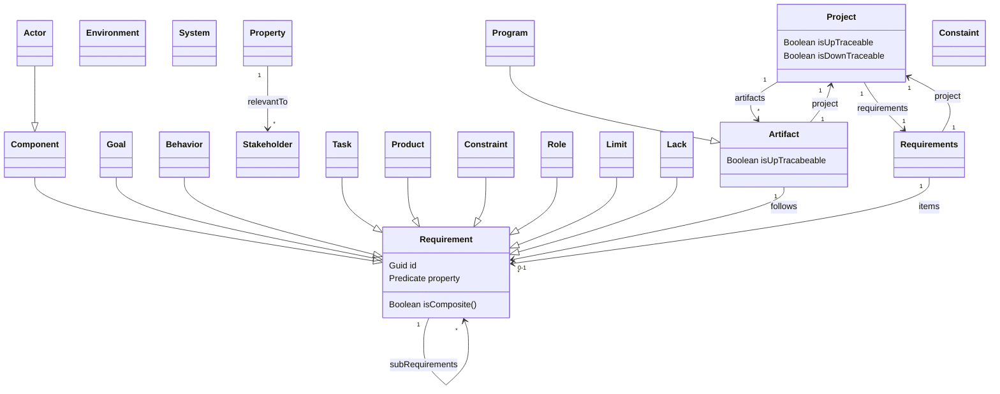

# PEGS Diagram

Reference: https://mermaid-js.github.io/mermaid/#/entityRelationshipDiagram

## Project

The set of human processes involved in the planning, construction, revision and operation of a system

### Up Traceability

### Down Traceability

For every requirement at least one artifact follows from it.

## Environment

The set of entities (people, organizations, regulations, devices and other material objects, other systems) external to the project or system but with the potential to affect it or be affected by it.

## Goal

## System

A set of related artifacts

## Requirements

## Requirement

A statement of a relevant project, system or environment property

### Property

Boolean predicate

**Elementary** or **Composite**

**Homogeneuous** or **Heterogeneous**

**Homogeneous** example: "customers will have access to customer functions, and employees to both customer and flight management functions"

**Heterogeneous** example: "Error messages shall be recorded in a log"
Refers to a system component(log) and a system behavior

### Statement

Human-readable expression of a property

## Artifact

### Up Traceability

Every element of every artifact follows from some element of the requirements