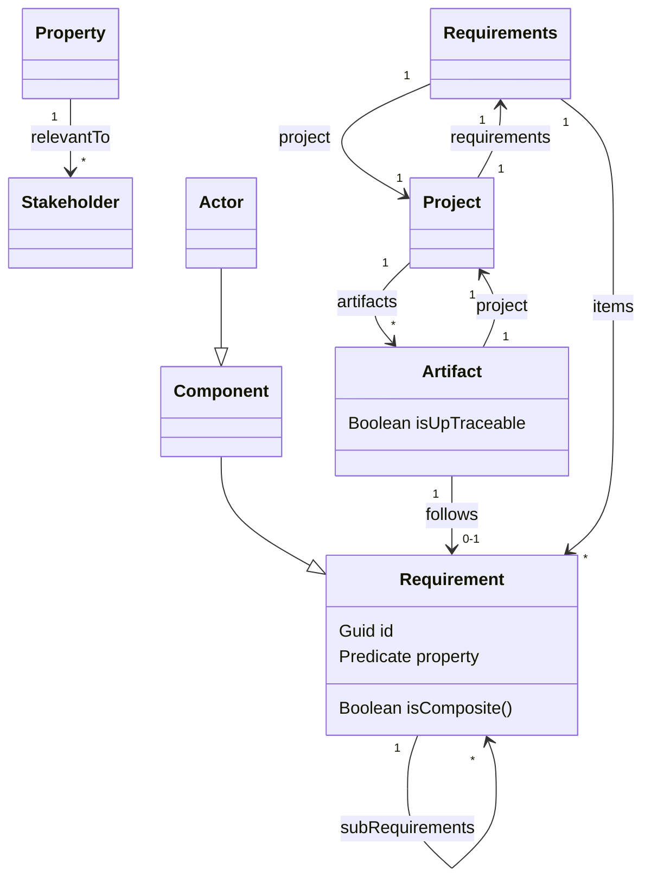

# PEGS Diagram

### Property

**Elementary** or **Composite**

**Homogeneous** or **Heterogeneous**

**Homogeneous** example: "customers will have access to customer functions, and employees to both customer and flight management functions"

**Heterogeneous** example: "Error messages shall be recorded in a log"
Refers to a system component(log) and a system behavior